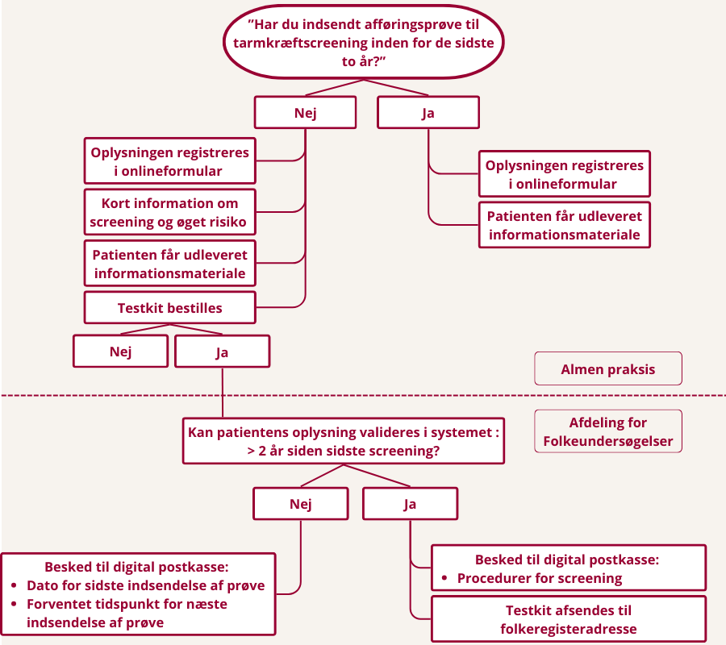

## Baggrund
Personer med type 2-diabetes har ca. 25 % øget risiko for at udvikle tarmkræft sammenlignet med baggrundsbefolkningen[^1]. Samtidig deltager personer med type 2-diabetes i mindre grad i det nationale screeningsprogram for tarmkræft[^1].

Tidlig opsporing gennem screening er en veldokumenteret og effektiv metode til at reducere både forekomst og dødelighed af tarmkræft. Screening anbefales til alle personer i aldersgruppen 50–74 år af både :contentReference[oaicite:0]{index=0} og :contentReference[oaicite:1]{index=1}[^2].

En kort, struktureret samtale i forbindelse med den årlige diabeteskontrol i almen praksis kan være en lavtærsklet og effektiv indsats til at øge deltagelsen i tarmkræftscreening blandt personer med type 2-diabetes.

[^1]: Laurberg et al. *Diabetic Medicine*, 2023.  
https://onlinelibrary.wiley.com/doi/10.1111/dme.15043

[^2]: Kræftens Bekæmpelse. *Screening for tarmkræft*.  
https://www.cancer.dk/forebyg-kraeft/screening/tarmkraeft/

## Hvad går projektet ud på?
Når patienter med type 2-diabetes kommer til deres årlige kontrol hos egen læge, bliver de spurgt:

**“Har du indsendt afføringsprøve til tarmkræftscreening inden for de sidste to år?”**

- Hvis patienten **har** deltaget, registreres svaret, og der udleveres informationsmateriale.  
- Hvis patienten **ikke har** deltaget, gives kort information, og der tilbydes hjælp til at bestille et testkit.

Efter konsultationen validerer screeningsenheden oplysningerne og sikrer, at patienten får korrekt information og evt. tilsendt testkit.  
Derudover indsamles erfaringer via frivillige interviews med både patienter og praksispersonale.

Se figur over projektets procesflow for den enkelte patient herunder. 

## Formål
Projektet har til formål at:

- Øge deltagelsen i tarmkræftscreening blandt personer med type 2-diabetes  
- Undersøge, om patienternes egen vurdering af screeningsstatus stemmer overens med registrerede data  
- Identificere barrierer og muligheder for at implementere den korte samtale i almen praksis  
- Belyse praksispersonalets oplevelse af arbejdsbyrde og anvendelighed  

## Målgruppe
- Personer med type 2-diabetes  
- Alder 50–74 år  
- Deltager i årskontrol for diabetes i medvirkende praksisser  

## Metode
Projektet kombinerer:

- Kvantitative data fra det regionale screeningssystem  
- Registreringer fra almen praksis  
- Frivillige interviews med patienter og praksispersonale  

Alle forskningsdata behandles pseudonymiseret.

## Samarbejdspartnere
Projektet er et samarbejde mellem Steno Diabetes Center Aarhus og Afdeling for Folkeundersøgelser samt udvalgte lægepraksis i Region Midtjylland.

**Finansiering:**  
Projektet er delvist finansieret af Kræftens Bekæmpelse.

## Projektgruppe

**Projektansvarlige**

- **Steno Diabetes Center Aarhus:** 

Tinne Laurberg  

- **Afdeling for Folkeundersøgelser:** 

Berit Andersen  

**Projektmedarbejdere** 

-**Steno Diabetes Center Aarhus**

Kasper Munch Lauridsen  

Tina Quist  

-**Afdeling for Folkeundersøgelser**

Hejdi Petersen

Kirstine Neander 

Anders Sønderup Nissen  

For kontaktoplysninger henvises til vores [kontaktside](kontakt.qmd).

## Tidsplan
- **Pilotafprøvning:** april–juni 2026  
- **Gennemførsel i almen praksis:** september–februar 2026/2027  
