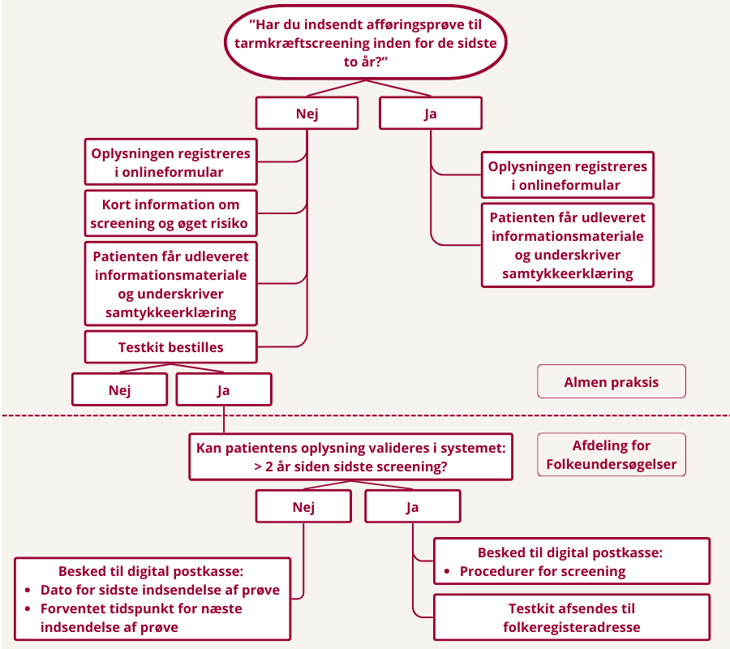

## Baggrund
Personer med type 2-diabetes har ca. 25 % øget risiko for at udvikle tarmkræft sammenlignet med baggrundsbefolkningen. Samtidig deltager personer med type 2-diabetes i mindre grad i det nationale screeningsprogram for tarmkræft [(Laurberg et al. 2023).](https://onlinelibrary.wiley.com/doi/10.1111/dme.15043)

Tidlig opsporing gennem screening er en veldokumenteret og effektiv metode til at reducere både forekomst og dødelighed af tarmkræft. 

Screeningsprogrammet anbefales til alle personer i aldersgruppen 50–74 år af både Sundhedsstyrelsen og [Kræftens Bekæmpelse.](https://www.cancer.dk/forebyg-kraeft/screening/tarmkraeft/)

En kort, struktureret samtale i forbindelse med den årlige diabeteskontrol i almen praksis kan være en lavtærsklet og effektiv indsats til at øge deltagelsen i tarmkræftscreening blandt personer med type 2-diabetes og dermed opspore kræfttilfælde tidligere og i sidste ende reducere dødelighed og senkomplikationer relateret til tarmkræft hos personer med type 2-diabetes.

Forandringsmekanismer der forventes aktiveret:

- **Troværdig anbefaling**: Almen praksis er patientens primære guide i sundhedsvæsenet. En direkte opfordring fra egen læge eller praksispersonale fungerer som en stærk katalysator, der øger sandsynligheden for handling væsentligt. 

- **Viden og relevans**: Ved at informere om den specifikke sammenhæng mellem T2D og tarmkræft øges patientens oplevede relevans af screening, hvilket styrker motivationen.  

- **Integration i kendte forløb**: Ved at italesætte screening som en fast del af årsstatus for diabetes, bringes emnet op i en legitim og tryg ramme. Patienten skal dermed ikke selv opsøge viden eller tage initiativ.  

- **Reduktion af praktiske barrierer**: Ved at bestille prøvetagningssættet direkte under konsultationen fjernes det administrative led for patienten. Dette sikrer, at overgangen fra viden til handling bliver så gnidningsfri som muligt. 

- **Forstærket handleintention**: Kombinationen af information, en konkret anbefaling og umiddelbar bestilling af prøvetagningssæt (med hurtig levering) skaber et momentum, der øger sandsynligheden for, at kittet rent faktisk anvendes og indsendes af patienten.  

## Hvad går projektet ud på?
Samtalen om screening for tarmkræft bygger på VBA-metoden kendt fra rygestop. VBA er en forkortelse af Very Brief Advise og et væsentligt element er, at der ikke er rigtige eller forkerte svar.

Vi vil bruge VBA-metoden til at få flere borgere med type 2-diabetes til at deltage i screening for tarmkræft. 

Samtalen om deltagelse i screening for tarmkræft tager ca. 2 minutter og integreres naturligt i årsstatus for diabetes. 
Samtalen kan udføres af alle medarbejdere i klinikken og kan også placeres ved prøvetagning forud for årsstatus.

VBA-metoden består af følgende elementer:

- **Spørg:** "Har du indsendt afføringsprøve til tarmkræftscreening inden for de sidste to år?"
- **Rådgiv:** Giv kort information om øget risiko og mulighederne ved screening
- **Bestil:** Bestil et prøvesæt 

Når patienter med type 2-diabetes kommer til deres årlige kontrol hos egen læge, bliver de spurgt:

**“Har du indsendt afføringsprøve til tarmkræftscreening inden for de sidste to år?”**

- Hvis patienten **har** deltaget, registreres svaret, og der udleveres informationsmateriale.  
- Hvis patienten **ikke har** deltaget, gives kort information, og klinikken tilbyder at bestille et prøvetagningssæt.

Almen praksis registrerer alle svar, indhenter skriftligt samtykke og foretager eventuel bestilling via online formular hos Afdeling for Folkesundhed.

Efter konsultationen validerer Afdeling for Folkesundhed oplysningerne og sikrer, at patienten får korrekt information og evt. tilsendt prøvetagningssæt.  
Derudover indsamles erfaringer via frivillige interviews med både patienter og praksispersonale.

Se figur over projektets flow for den enkelte patient herunder. 

## Formål
Projektet har til formål at:

- Øge deltagelsen i tarmkræftscreening blandt personer med type 2-diabetes  
- Undersøge, om patienternes egen vurdering af screeningsstatus stemmer overens med registrerede data  
- Identificere barrierer og muligheder for at implementere den korte samtale i almen praksis  
- Belyse praksispersonalets oplevelse af arbejdsbyrde og anvendelighed  

## Målgruppe
- Personer med type 2-diabetes  
- Alder 51–74 år  
- Deltager i årskontrol for diabetes i medvirkende praksisser  

## Metode
Projektet kombinerer:

- Kvantitative data fra det regionale screeningssystem  
- Registreringer fra almen praksis  
- Frivillige interviews med patienter og praksispersonale  

Alle forskningsdata behandles pseudonymiseret.

## Samarbejdspartnere
Projektet er et samarbejde mellem Steno Diabetes Center Aarhus og Afdeling for Folkeundersøgelser samt udvalgte lægepraksis i Region Midtjylland.

**Finansiering:**  
Projektet er delvist finansieret af Kræftens Bekæmpelse.

## Projektgruppe

**Steno Diabetes Center Aarhus:** 

- Tinne Laurberg, projektansvarlig
- Kasper Munch Lauridsen, projektmedarbejder
- Tina Quist, projektmedarbejder

**Afdeling for Folkeundersøgelser:** 

- Berit Andersen, projektansvarlig  
- Hejdi Petersen, projektmedarbejder
- Christine Neander, projektmedarbejder 
- Anders Sønderup Nissen, projektmedarbejder  

For kontaktoplysninger henvises til vores [kontaktside](kontakt.qmd).

## Tidsplan
- **Pilotafprøvning:** april–juni 2026  
- **Gennemførsel i almen praksis:** september–februar 2026/2027  
